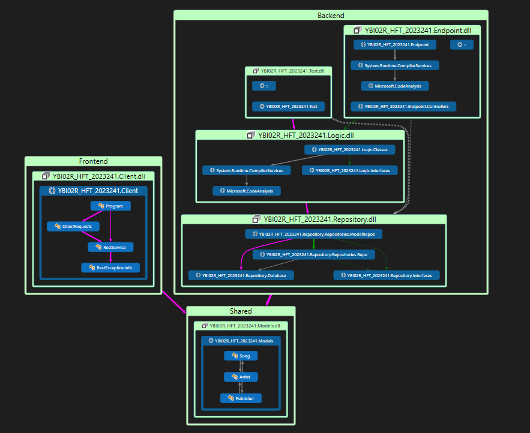

# C# LAYERED ARCHITECTURE PROJECT
 Haladó Fejlesztési Technikák Féléves Feladat 2023/24/1 félév

## Layout

Egy rétegzett CRUD alkalmazás, amely saját adatbázison alapul.
Az alkalmazás összesen 3 adattáblát tartalmaz, amelyek idegen kulcsokkal kapcsolódnak egymáshoz, ezek a Model osztályokban vannak reprezentálva. A Logic réteg CRUD műveleteket biztosít, valamint több nem-CRUD műveletet is megvalósít, amelyek több táblás lekérdezéseket használnak.A Test projektben a NUnit és Moq könyvtárak találhatóak, több mint 15 egységtesztel. A projekt tartalmazza a megfelelő függőségeket és Dependency Injection-t használ. A Logic réteg csak interfészen keresztül kapta meg a Repository-t, a Repository pedig csak a DbContext-et. Az API-k kommunikációja a konzolos alkalmazással JSON üzenetek segítségével történt, és az API-k funkcionalitása megfelel az alapvető HTTP műveleteknek (GET, POST, PUT, DELETE).

.NET 5.0 v, Entity Framework Core, InMemoryDb
